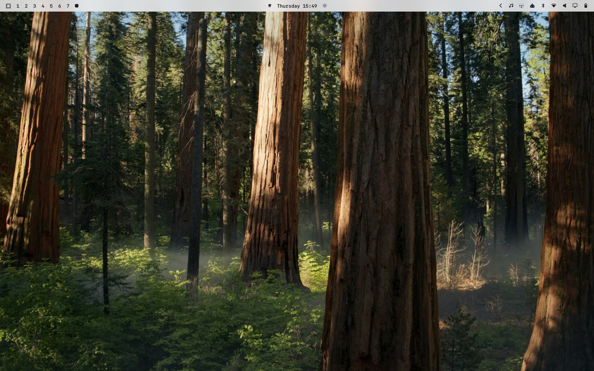
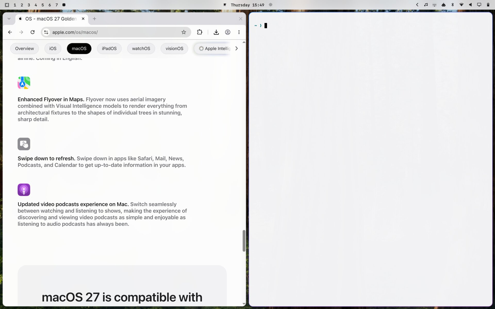

# Cupertino Light

A light, macOS-inspired theme for [Omarchy](https://omarchy.org). Dark sibling: [Cupertino Dark](https://github.com/jonnyace/omarchy-cupertino-dark-theme).




System blue accent, frosted shell surfaces, Sequoia-matching 10px rounding, and Yaru-blue icons.

## Install

```bash
omarchy theme install https://github.com/jonnyace/omarchy-cupertino-light-theme.git
```

Or copy that URL and choose *Install > Style > Theme* from the Omarchy menu (`Super + Space`).

## Extra wallpapers

The theme ships with one original background. Classic macOS defaults (Tahoe, Sequoia, Sonoma, and earlier) are not bundled — those images are Apple's copyright.

Download them from [Every Default macOS Wallpaper in 6K](https://512pixels.net/projects/default-mac-wallpapers-in-5k/) and drop the files into:

```
~/.config/omarchy/backgrounds/cupertino-light/
```

Then cycle with `Super + Ctrl + Space` or `omarchy theme bg next`.

## Apple fonts (optional)

Cupertino does not bundle Apple's fonts — their license does not allow redistribution. If you want the icing on the cake, download **SF Pro** (UI) and **SF Mono** (terminal) from [Apple's fonts page](https://developer.apple.com/fonts/) (Apple ID required).

On Linux, extract the `.dmg` / `.pkg` and copy the `.otf` / `.ttf` files into `~/.local/share/fonts`, then:

```bash
fc-cache -f ~/.local/share/fonts
omarchy font set "SF Mono"
gsettings set org.gnome.desktop.interface font-name "SF Pro Text 11"
gsettings set org.gnome.desktop.interface document-font-name "SF Pro Text 11"
gsettings set org.gnome.desktop.interface monospace-font-name "SF Mono 11"
```

Keep a Nerd Font as a fallback so Omarchy bar icons still render.

Omarchy themes do not set a typeface — `omarchy font set` is system-wide. To apply SF only while Cupertino is active (and restore JetBrains Mono + Adwaita Sans when you switch away):

```bash
omarchy hook install theme-set ~/.config/omarchy/themes/cupertino-light/hooks/60-cupertino-fonts
```

After that, switching to Tokyo Night or anything else drops the Apple fonts.
